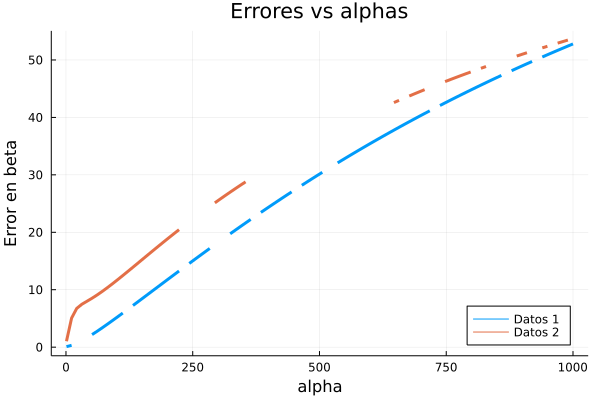
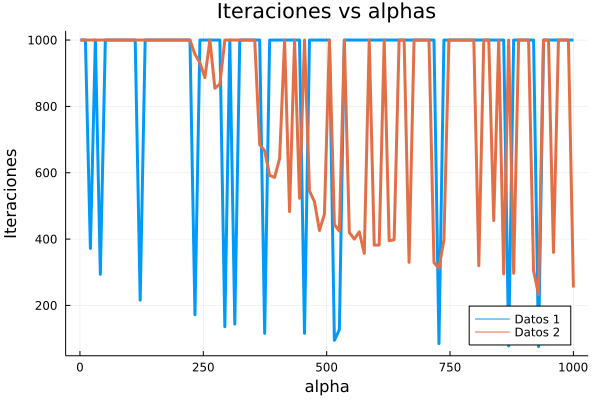

# Trabajo Practico 1

## Estimador de minimos cuadrados

Se tienen n observaciones $x^{(i)} = (x_j^{(i)})_{j=1}^p$, $1<=i <=n$.

n respuestas $y_i$ Y se buscan estimar los $\beta_j$ con

$$
Y = \sum_{j=1}^p \beta_j X_j, X_j = x^{(j)}
$$

Sean

$$
Y = (y_1, ..., y_n)^T\\
\beta = (\beta_1, ..., \beta_n)^T\\
X = (x^{(1)}, ..., x^{(n)})^T\\
$$

### Ejercicio 1

Tenemos:

$$
f(\beta) = \sum_{i=1}^n \bigg( y_i-\sum_{j=1}^p \beta_j x_j^{(i)}\bigg)^2
$$

Luego

$$
\frac{\delta f}{\delta \beta_k}
= -2 \sum_{i=1}^n \bigg( y_i-\sum_{j=1}^p \beta_j x_j^{(i)}\bigg)x_k^{(i)} \\
= -2 \bigg[  \sum_{i=1}^n  y_ix_k^{(i)}-\sum_{i=1}^n  \sum_{j=1}^p \beta_j x_j^{(i)}x_k^{(i)} \bigg]\\
$$

Debido a que

$$
X^TY=(x^{(1)}, ..., x^{(n)}) Y = \sum_{i=1}^n x^{(i)} y_i = \bigg(\sum_{i=1}^n x_k^{(i)} y_i \bigg)_{k=1}^p
$$

Y que

$$
X^TX\beta = X^T \sum_{j=1}^p \beta_j X_j = \sum_{j=1}^p \beta_j \sum_{i=1}^n x_j^{(i)} x^{(i)}
$$

Asi

$$
\nabla f = -2 \bigg[  \sum_{i=1}^n  y_i \bigg( x_k^{(i)}\bigg)_{k=1}^p -\sum_{i=1}^n  \sum_{j=1}^p \beta_j x_j^{(i)}\bigg( x_k^{(i)}\bigg)_{k=1}^p \bigg]
$$

$$
= -2 \bigg[  \sum_{i=1}^n  y_i x^{(i)} -\sum_{i=1}^n  \sum_{j=1}^p \beta_j x_j^{(i)}x^{(i)} \bigg]\\
= -2 \bigg[ X^T Y - X^TX\beta\bigg]
$$

Ahora.

$$
\frac{\delta^2 f}{\delta \beta_k \delta \beta_m} =
-2 \sum_{i=1}^n x_k^{(i)} x_m^{(i)} \\
= 2 (X^T X)_{k, m}
$$

Luego,

$$
H(f) = 2X^TX
$$

### Ejercicio 2

$f$ es convexa en $\mathbb{R}^p$:
Tenemos que,

$$
f: \mathbb{R}^p \rightarrow \mathbb{R} / f(\beta) = ||Y - X\beta ||^2
$$

$\mathbb{R}^p$ es convexo:
Sean $x, y$ en $\mathbb{R}^p$ y $t$ en $[0,1]$. Luego:

$$
tx + (1-t)t \in \mathbb{R}^p \rightarrow \mathbb{R}^p \text{ es convexo}
$$

$f$ es convexa sii $H(f)$ es definida positiva sii
para todo $Z\in \mathbb{R}^p$ tenemos que

$$
Z^T(2X^T X) Z >=0
$$

Esto se cumple dado que
$Z^T(2X^T X) Z = 2||XZ||^2$.

### Ejercicio 3

Juntando todo lo visto previamente, podemos escribir:

$$
f(\beta) = \frac{1}{2} \beta ^T G \beta + b^T \beta + C
$$

Donde

$$
G = 2X^T X, \; b = -2X^TY, \; C=Y^TY
$$

Los resultados son:

|                     | Datos 1 | Datos 2 |
| ------------------- | ------- | ------- |
| Error en beta       | 0.0844  | 0.6128  |
| Iteraciones         | 100     | 100     |
| Numero de condicion | 247     | 3x10^7  |

Podemos ver que el numero de condicion para la matriz de diseño con los datos 2 es mucho mas grande que para los datos 1, por lo que la matriz 2 esta mal condicionada.

## Regresion Ridge

### Ejercicio 4

Para esta function tenemos.

$$
f_R = f + \alpha \beta \beta^T
$$

Luego el gradiente y la matriz hessianas son:

$$
\nabla f_R = 2X^TX\beta-2X^TY+2\alpha\beta \\
H(f_R) = 2(X^TX + \alpha I)
$$

### Ejercicio 5

El numero de condicion de la matriz hessiana es el cociente del maximo autovalor sobre el minimo autovalor.
Sea $\lambda, v$ autovalor y autovector de la matriz $A=H(f)$. Luego, como $H(f_R) = A_R = A + 2 \alpha I$. Entonces $\lambda + 2 \alpha, v$ es un autovalor y autovector correspondientes a $A_R$.
Entonces, el numero de condicion de $A_R$ seria:

$$
\frac{2\alpha + \lambda_{max}}{2\alpha + \lambda_{min} }
$$

Donde los lambdas corresponden a $A$. Cuando alfa tiende a infinito el numero de condicion de $A$ y $A_R$ se aproximan.

### Ejercicio 6

Juntando todo lo visto previamente, podemos escribir:

$$
f_R(\beta) = \frac{1}{2} \beta ^T G_R \beta + b^T \beta + C
$$

Donde

$$
G_R = 2X^T X + 2\alpha I, \; b = -2X^TY, \; C=Y^TY
$$

Podemos ver que para la matriz 2 los errores son mucho mas grandes debido al mal condicionamiento. Podemos ver que a medida que $\alpha$ tiende a infinito, los errores se aproximan entre si.

